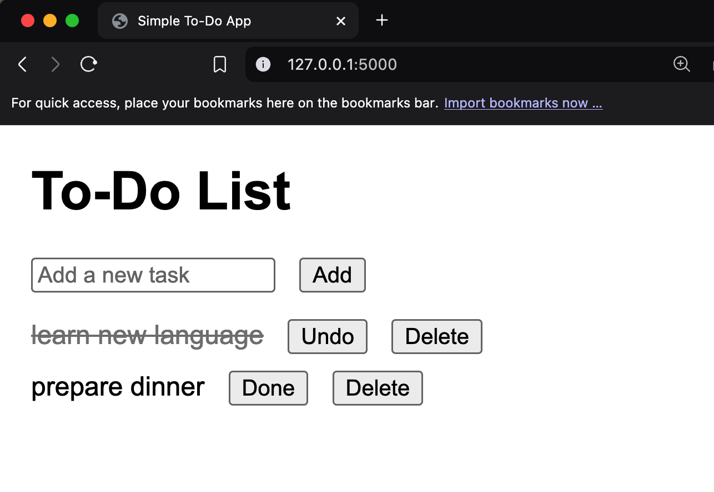

# Flask TODO App  

A simple TODO application built using Flask, designed for beginners to understand the basics of Flask routing, templates, and handling user input.

## Features

- Add tasks to your TODO list.
- Mark tasks as done/undone.
- Delete tasks from the list.

## Prerequisites

- Python (version 3.7 or higher recommended)
- pip (Python package manager)

## Installation

1. **Clone the Repository**  
   Clone this repository to your local machine:

   ```bash
   git clone https://github.com/your-repository/flask-todo-app.git
   cd flask-todo-app

2. **Set Up a Virtual Environment**  
   Create and activate a virtual environment:
   ```
    python -m venv venv
    source venv/bin/activate  # On Windows: venv\Scripts\activate

   ```
3. **Install Dependencies**  
   Install the required Python packages:
   ```
    pip install flask

   ```
## Usage

1. **Run the App**  
   Start the Flask development server::
   ```
    python app.py

    ```
    The app will run on http://127.0.0.1:5000.

## Future Improvements
    Add database integration for persistent storage.
    Implement user authentication.
    Enhance UI with CSS frameworks.

## App UI


